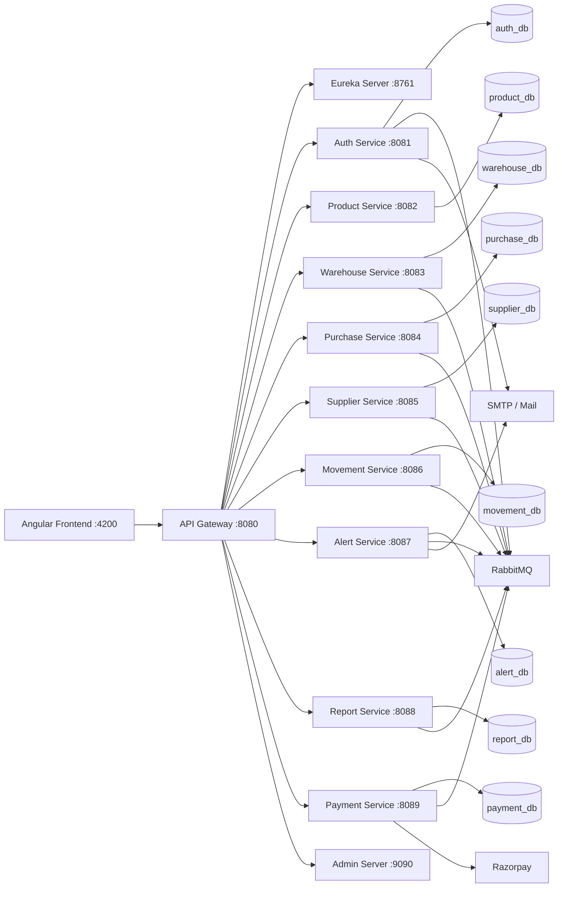
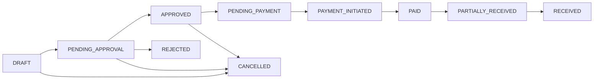
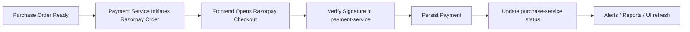
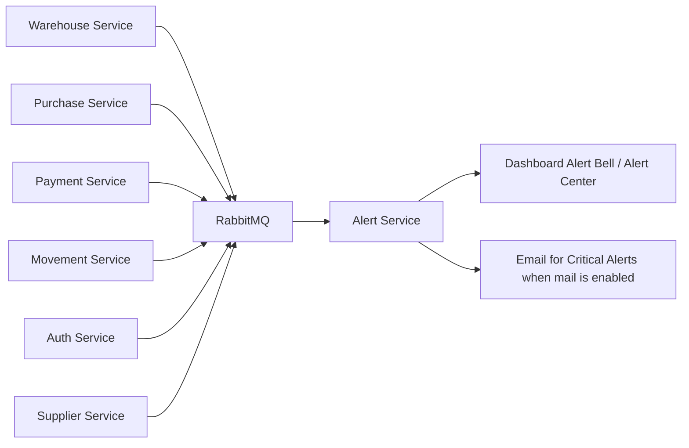
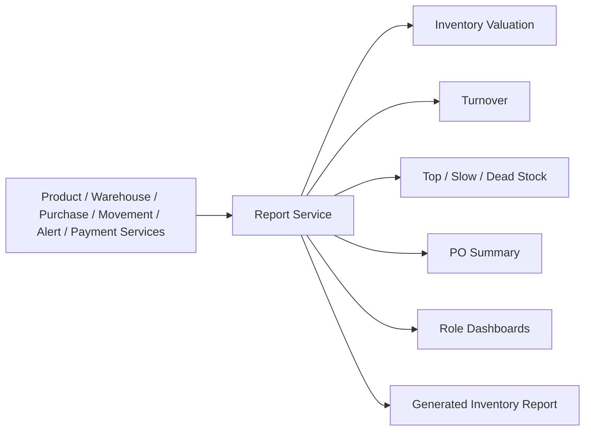
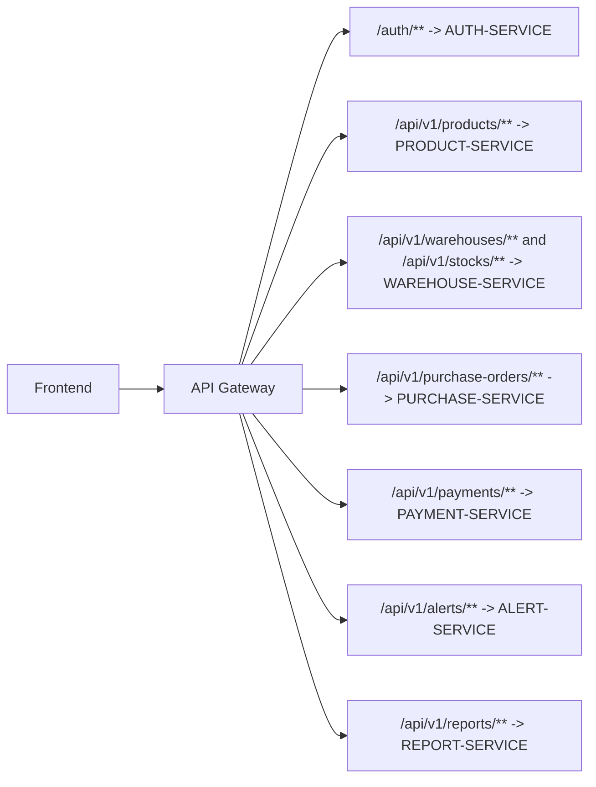

# StockPro Backend - Microservices Inventory Management System

## Project Overview

StockPro Backend is a Spring Boot microservices platform for inventory, warehouse, supplier, purchasing, payment, movement, alert, and analytics workflows. The implementation is structured for a multi-service business environment where the Angular frontend accesses the platform through a single API Gateway, services register with Eureka, and cross-service notifications and domain events flow through RabbitMQ.

The current codebase is suitable for mid-size businesses that need role-based inventory operations, purchase approval workflows, warehouse stock control, payment orchestration, operational alerts, and reporting APIs.

Frontend repository: `InventoryManagementSystemApp-Frontend`

## Key Features

Only features verified in the current repositories are listed here.

- JWT authentication with access token and refresh token support
- Email OTP flow for registration verification and password reset
- Google OAuth2 login support in `auth-service`
- Admin-only user management and role administration
- Product management with SKU and barcode lookup
- Warehouse master management and stock operations
- Supplier management, activation, blacklist, rating, and performance flows
- Purchase order lifecycle from draft to approval, payment, and receipt
- Goods receipt workflow through purchase and stock services
- Stock movement tracking, movement reversal, analytics, and CSV export
- RabbitMQ-driven alert and event distribution
- Role-targeted alert center and alert analytics APIs
- Razorpay order initiation, verification, failure, and cancellation handling
- Inventory and purchase reporting APIs
- Swagger/OpenAPI on the gateway and business services
- Actuator health endpoints
- Test suites with Spring Boot Test, Spring Security Test, H2-backed test configs, and JaCoCo/Sonar configuration
- Central logging configuration with `logback-spring.xml` in services

## Architecture Overview

StockPro follows a service-oriented backend architecture.

- `api-gateway` is the browser-facing entry point and applies JWT validation and CORS configuration.
- `eureka-server` provides service discovery for the business services and gateway.
- Each business service owns its own database schema or database connection target.
- RabbitMQ is used for asynchronous domain events such as OTP dispatch, warehouse alerts, purchase alerts, payment alerts, movement alerts, and report-related events.
- The Angular frontend is expected to call only the gateway at `http://localhost:8080`.

## Architecture Diagram



## Microservices Table

| Service | Purpose | Port | Main Routes |
| --- | --- | ---: | --- |
| `eureka-server` | Service discovery registry | `8761` | `/`, `/eureka` |
| `api-gateway` | Entry point, JWT validation, CORS, Swagger aggregation | `8080` | `/auth/**`, `/api/v1/**`, `/swagger-ui.html` |
| `auth-service` | Authentication, OTP, profile, admin user management, OAuth2 | `8081` | `/auth/register`, `/auth/verify-otp`, `/auth/login`, `/auth/refresh`, `/auth/forgot-password`, `/auth/reset-password`, `/auth/profile`, `/auth/users` |
| `product-service` | Product master data, search, categories, brands, SKU/barcode lookup | `8082` | `/api/v1/products`, `/api/v1/products/search`, `/api/v1/products/summary`, `/api/v1/products/barcode/{barcode}` |
| `warehouse-service` | Warehouse master data and stock operations | `8083` | `/api/v1/warehouses`, `/api/v1/stocks`, `/api/v1/stocks/receive`, `/api/v1/stocks/issue`, `/api/v1/stocks/transfer`, `/stock/barcode/{barcode}` |
| `purchase-service` | Purchase order lifecycle, approvals, payment state transitions, receipt | `8084` | `/api/v1/purchase-orders`, `/api/v1/purchase-orders/{id}/submit`, `/api/v1/purchase-orders/{id}/approve`, `/api/v1/purchase-orders/{id}/submit-for-payment`, `/api/v1/purchase-orders/{id}/receive`, `/api/v1/purchase-orders/summary`, `/api/v1/purchase-orders/analytics` |
| `supplier-service` | Supplier management, rating, blacklist, performance | `8085` | `/api/v1/suppliers`, `/api/v1/suppliers/search`, `/api/v1/suppliers/summary`, `/api/v1/suppliers/{id}/blacklist`, `/api/v1/suppliers/{id}/performance` |
| `movement-service` | Stock movement audit trail, analytics, reversal, export | `8086` | `/api/v1/movements`, `/api/v1/movements/search`, `/api/v1/movements/summary`, `/api/v1/movements/analytics`, `/api/v1/movements/{id}/reverse`, `/api/v1/movements/export/csv` |
| `alert-service` | Alert inbox, broadcast alerts, read/acknowledge/resolve, analytics | `8087` | `/api/v1/alerts`, `/api/v1/alerts/my`, `/api/v1/alerts/search`, `/api/v1/alerts/broadcast`, `/api/v1/alerts/summary/my`, `/api/v1/alerts/analytics` |
| `report-service` | Inventory and purchase analytics APIs | `8088` | `/api/v1/reports/totalValue`, `/api/v1/reports/byWarehouse`, `/api/v1/reports/turnover`, `/api/v1/reports/lowStock`, `/api/v1/reports/overstock`, `/api/v1/reports/movements`, `/api/v1/reports/dashboard`, `/api/v1/reports/poSummary`, `/api/v1/reports/generateReport` |
| `payment-service` | Razorpay order/payment workflow and PO payment summaries | `8089` | `/api/v1/payments`, `/api/v1/payments/summary`, `/api/v1/payments/purchase-order/{id}`, `/api/v1/payments/razorpay/initiate`, `/api/v1/payments/razorpay/verify` |
| `Admin-server` | Spring Boot Admin monitoring UI | `9090` | `/` |

## Role Matrix

| Role | Capabilities |
| --- | --- |
| Admin | Manage users and roles, create/update warehouses, manage products, oversee suppliers, approve/reject purchase orders, access payments, alerts, and reports |
| Inventory Manager | Manage products and warehouses, perform stock oversight, approve or reject purchase orders, receive goods, monitor alerts, access inventory and movement reports |
| Purchase Officer | Manage suppliers, create and submit purchase orders, access Razorpay payment flow, view purchasing analytics and payment summaries |
| Warehouse Staff | Receive goods, issue/reserve/release/transfer/adjust stock, access barcode stock lookup, track movements, view alerts and warehouse-focused reports |

## Purchase Order Lifecycle

The verified purchase status enum in `purchase-service` is:

- `DRAFT`
- `PENDING_APPROVAL`
- `APPROVED`
- `PENDING_PAYMENT`
- `PAYMENT_INITIATED`
- `PAID`
- `PARTIALLY_RECEIVED`
- `RECEIVED`
- `CANCELLED`
- `REJECTED`
- `FULLY_RECEIVED` exists as a deprecated enum value

### Workflow Diagram



Operational summary:

1. Purchase Officer or Admin creates a PO in `DRAFT`.
2. The PO is submitted for approval.
3. Admin or Inventory Manager approves or rejects it.
4. Approved POs can be submitted for payment.
5. Payment-service updates the PO with `PAYMENT_INITIATED` and `PAID` transitions.
6. Warehouse Staff, Inventory Manager, or Admin can receive goods.
7. Receipt can move the order through `PARTIALLY_RECEIVED` to `RECEIVED`.

## Payment Flow

StockPro uses Razorpay from `payment-service`.

### Verified payment flow

1. A payable purchase order is selected from the frontend.
2. The backend creates a Razorpay order through `POST /api/v1/payments/razorpay/initiate`.
3. The frontend opens Razorpay Checkout using the returned order id and key id.
4. The frontend posts verification data to `POST /api/v1/payments/razorpay/verify`.
5. `payment-service` verifies the signature, persists the payment, and updates purchase status through `purchase-service`.
6. Failure and cancellation are also recorded through dedicated endpoints.
7. Split-payment planning is available through `POST /api/v1/payments/split-plan` and is restricted to Admin by controller security.

### Payment diagram



Required backend variables:

- `RAZORPAY_KEY_ID`
- `RAZORPAY_KEY_SECRET`

Do not place these secrets in source control.

## Alert / Notification Flow

Alert creation is event-driven and role-aware.

### Verified alert areas

- Low stock alerts
- Overstock alerts
- Purchase approval pending alerts
- Purchase approved/rejected/received/overdue alerts
- Payment alerts
- Movement alerts
- Auth OTP notification events
- Broadcast alerts for Admin
- Optional email notifications through `alert-service` mail configuration

### Alert flow diagram



Representative queue and routing patterns from config:

- `stockpro.alert.warehouse.low-stock.queue`
- `stockpro.alert.warehouse.overstock.queue`
- `stockpro.alert.purchase.pending-approval.queue`
- `stockpro.alert.purchase.overdue.queue`
- `stockpro.alert.payment.queue`
- `stockpro.alert.movement.queue`
- `stockpro.auth.otp.queue`

## Report / Analytics Service

The verified `report-service` controller currently exposes:

- total inventory valuation
- stock valuation by warehouse
- inventory turnover
- low-stock report
- overstock report
- warehouse stock summary report
- stock movement report
- role-aware dashboard data
- executive dashboard data
- top-moving products
- slow-moving products
- dead-stock report
- purchase order summary
- generated consolidated inventory report

What is also visible in configuration:

- optional scheduler support via `REPORT_SCHEDULER_ENABLED`
- inventory snapshot entity and scheduler classes exist in `report-service`
- RabbitMQ report event publishing configuration exists

### Reporting flow diagram



## API Gateway Routes

The gateway is configured to expose these route families:

| Gateway route pattern | Target service |
| --- | --- |
| `/auth/**` | `AUTH-SERVICE` |
| `/oauth2/**` | `AUTH-SERVICE` |
| `/login/oauth2/**` | `AUTH-SERVICE` |
| `/api/v1/auth/**` | `AUTH-SERVICE` with rewrite to `/auth/**` |
| `/api/v1/products/**` | `PRODUCT-SERVICE` |
| `/products/**` | legacy rewrite to `PRODUCT-SERVICE` |
| `/api/v1/warehouses/**` | `WAREHOUSE-SERVICE` |
| `/api/v1/stocks/**` | `WAREHOUSE-SERVICE` |
| `/warehouses/**` | legacy rewrite to `WAREHOUSE-SERVICE` |
| `/stock/**` | legacy rewrite to `WAREHOUSE-SERVICE` |
| `/api/v1/suppliers/**` | `SUPPLIER-SERVICE` |
| `/suppliers/**` | legacy rewrite to `SUPPLIER-SERVICE` |
| `/api/v1/purchase-orders/**` | `PURCHASE-SERVICE` |
| `/api/v1/movements/**` | `MOVEMENT-SERVICE` |
| `/movements/**` | legacy rewrite to `MOVEMENT-SERVICE` |
| `/api/v1/reports/**` | `REPORT-SERVICE` |
| `/reports/**` | legacy rewrite to `REPORT-SERVICE` |
| `/api/v1/payments/**` | `PAYMENT-SERVICE` |
| `/payments/**` | legacy rewrite to `PAYMENT-SERVICE` |
| `/api/v1/alerts/**` | `ALERT-SERVICE` |
| `/alerts/**` | legacy rewrite to `ALERT-SERVICE` |

### Gateway routing diagram



## Technology Stack

- Java 17
- Spring Boot `3.2.2` to `3.2.5` across modules
- Spring Cloud `2023.0.x`
- Spring Cloud Gateway
- Netflix Eureka Server and Eureka Client
- Spring Security
- JWT (`jjwt`)
- Spring Data JPA
- MySQL
- RabbitMQ via `spring-boot-starter-amqp`
- Razorpay integration in `payment-service`
- JavaMailSender / Spring Mail
- Springdoc OpenAPI / Swagger UI
- Spring Boot Actuator
- Maven Wrapper
- JUnit 5 / Spring Boot Test / Spring Security Test
- JaCoCo
- Sonar Maven Plugin
- Dockerfiles per service

No Flyway or Liquibase configuration was found in the analyzed services.

## Prerequisites

- Java 17
- Maven or Maven Wrapper
- MySQL
- RabbitMQ
- Docker Desktop if you want to use the included container assets
- Node.js and Angular frontend from `InventoryManagementSystemApp-Frontend` for end-to-end UI testing

## Environment Variables

Use environment variables or a secure secret manager. Do not commit real secrets.

| Variable | Purpose | Example |
| --- | --- | --- |
| `JWT_SECRET` | Shared JWT signing secret used by gateway and secured services | `change-me` |
| `AUTH_DB_USERNAME` | Auth database username | `root` |
| `AUTH_DB_PASSWORD` | Auth database password | `change-me` |
| `PRODUCT_DB_USERNAME` | Product database username | `root` |
| `PRODUCT_DB_PASSWORD` | Product database password | `change-me` |
| `WAREHOUSE_DB_USERNAME` | Warehouse database username | `root` |
| `WAREHOUSE_DB_PASSWORD` | Warehouse database password | `change-me` |
| `PURCHASE_DB_USERNAME` | Purchase database username | `root` |
| `PURCHASE_DB_PASSWORD` | Purchase database password | `change-me` |
| `SUPPLIER_DB_USERNAME` | Supplier database username | `root` |
| `SUPPLIER_DB_PASSWORD` | Supplier database password | `change-me` |
| `MOVEMENT_DB_USERNAME` | Movement database username | `root` |
| `MOVEMENT_DB_PASSWORD` | Movement database password | `change-me` |
| `PAYMENT_DB_USERNAME` | Payment database username | `root` |
| `PAYMENT_DB_PASSWORD` | Payment database password | `change-me` |
| `ALERT_DB_USERNAME` | Alert database username | `root` |
| `ALERT_DB_PASSWORD` | Alert database password | `change-me` |
| `REPORT_DB_USERNAME` | Report database username | `root` |
| `REPORT_DB_PASSWORD` | Report database password | `change-me` |
| `MAIL_USERNAME` | SMTP username for OTP / mail notifications | `your-email@gmail.com` |
| `MAIL_PASSWORD` | SMTP app password | `your-app-password` |
| `MAIL_FROM` | From address used by auth-service | `no-reply@stockpro.local` |
| `RAZORPAY_KEY_ID` | Razorpay public key id returned to frontend | `rzp_test_xxxxx` |
| `RAZORPAY_KEY_SECRET` | Razorpay secret used only on backend | `change-me` |
| `FRONTEND_URL` | Allowed frontend origin / callback base | `http://localhost:4200` |
| `EUREKA_CLIENT_SERVICEURL_DEFAULTZONE` | Eureka client registration URL | `http://localhost:8761/eureka` |
| `EUREKA_SERVER_URL` | Eureka URL used by some services | `http://localhost:8761/eureka` |
| `RABBITMQ_HOST` | RabbitMQ host | `localhost` |
| `RABBITMQ_PORT` | RabbitMQ port | `5672` |
| `RABBITMQ_USERNAME` | RabbitMQ username | `guest` |
| `RABBITMQ_PASSWORD` | RabbitMQ password | `guest` |
| `GOOGLE_CLIENT_ID` | Google OAuth client id | `your-client-id` |
| `GOOGLE_CLIENT_SECRET` | Google OAuth client secret | `your-client-secret` |
| `GOOGLE_REDIRECT_URI` | Google OAuth callback URI | `http://localhost:8080/login/oauth2/code/google` |

## Local Setup

1. Clone the backend repository.
2. Start MySQL.
3. Start RabbitMQ.
4. Set the required environment variables.
5. Start `eureka-server`.
6. Start the business services.
7. Start `api-gateway`.
8. Optionally start `Admin-server`.
9. Verify service registration in Eureka.
10. Open Swagger through the gateway.

Suggested startup order based on dependencies:

1. `eureka-server`
2. `auth-service`
3. `product-service`
4. `warehouse-service`
5. `supplier-service`
6. `purchase-service`
7. `payment-service`
8. `movement-service`
9. `alert-service`
10. `report-service`
11. `api-gateway`
12. `Admin-server` optional

## Running Services

### Windows

```powershell
cd C:\Users\suraj\OneDrive\Desktop\InventoryManagementSystemApp\auth-service
.\mvnw.cmd spring-boot:run
```

### Linux / macOS

```bash
cd InventoryManagementSystemApp/auth-service
./mvnw spring-boot:run
```

Repeat the same pattern for each service directory.

### Build command

Windows:

```powershell
.\mvnw.cmd clean install
```

Linux / macOS:

```bash
./mvnw clean install
```

## Docker Setup

Docker support present in the repository:

- `Dockerfile` exists in each microservice directory
- root-level `docker-compose.yml` exists

Current compose file coverage:

- `mysql`
- `redis`
- `rabbitmq`
- `eureka-server`
- `product-service`
- `alert-service`

Example command:

```powershell
cd C:\Users\suraj\OneDrive\Desktop\InventoryManagementSystemApp
docker compose up -d
```

Important note:

- the current compose file does not bring up the full microservice platform end-to-end
- it also maps `alert-service` to `8089` even though the service configuration uses `8087`, so review compose before using it as the primary local runtime

## Testing

Per-service test commands:

```powershell
.\mvnw.cmd test
.\mvnw.cmd clean test
```

Linux / macOS equivalents:

```bash
./mvnw test
./mvnw clean test
```

Testing and quality notes observed in the repository:

- service-level Spring Boot tests are present
- Spring Security test support is configured in secured services
- H2 is included as a test dependency in business services
- JaCoCo Maven plugin is configured in the business services
- Sonar Maven plugin properties are present in service `pom.xml` files

Typical JaCoCo output path:

```text
target/site/jacoco/jacoco.xml
```

## Swagger / OpenAPI

Gateway Swagger UI:

- `http://localhost:8080/swagger-ui.html`

Gateway-routed service docs:

- `http://localhost:8080/auth-service/v3/api-docs`
- `http://localhost:8080/product-service/v3/api-docs`
- `http://localhost:8080/warehouse-service/v3/api-docs`
- `http://localhost:8080/supplier-service/v3/api-docs`
- `http://localhost:8080/purchase-service/v3/api-docs`
- `http://localhost:8080/movement-service/v3/api-docs`
- `http://localhost:8080/alert-service/v3/api-docs`
- `http://localhost:8080/report-service/v3/api-docs`
- `http://localhost:8080/payment-service/v3/api-docs`

Direct service Swagger URLs:

- `http://localhost:8081/swagger-ui.html`
- `http://localhost:8082/swagger-ui.html`
- `http://localhost:8083/swagger-ui.html`
- `http://localhost:8084/swagger-ui.html`
- `http://localhost:8085/swagger-ui.html`
- `http://localhost:8086/swagger-ui.html`
- `http://localhost:8087/swagger-ui.html`
- `http://localhost:8088/swagger-ui.html`
- `http://localhost:8089/swagger-ui.html`

## Common Troubleshooting

- Port already in use: check `8080` through `8089`, `8761`, `9090`, `3306`, `5672`, and `15672`
- Eureka service not registered: make sure `eureka-server` is running before starting client services
- MySQL access denied: verify service-specific DB usernames/passwords and host access
- RabbitMQ not running: OTP, alerts, and event-driven flows will fail or degrade
- `JWT_SECRET` missing: gateway and secured services will reject or fail to validate tokens
- Razorpay key missing: `payment-service` cannot initiate checkout without `RAZORPAY_KEY_ID` and `RAZORPAY_KEY_SECRET`
- CORS issue: use the gateway at `http://localhost:8080` and frontend at `http://localhost:4200`
- Gateway `503`: service may not be registered in Eureka or may be unhealthy
- OAuth callback problems: verify `GOOGLE_REDIRECT_URI` and `FRONTEND_URL`
- Flyway failed migration: not applicable in the current analyzed codebase because Flyway was not found

## Folder Structure

```text
InventoryManagementSystemApp/
|-- api-gateway/
|-- eureka-server/
|-- auth-service/
|-- product-service/
|-- warehouse-service/
|-- purchase-service/
|-- supplier-service/
|-- movement-service/
|-- alert-service/
|-- report-service/
|-- payment-service/
|-- Admin-server/
|-- docker-compose.yml
`-- README.md
```

## Security Notes

- Never commit JWT secrets, database passwords, Gmail passwords, OAuth secrets, or Razorpay secrets
- Use environment variables or a secret manager for all sensitive values
- All protected APIs rely on JWT validation
- Business authorization is enforced with role-based access using Spring Security and `@PreAuthorize`
- The frontend should always access the platform through the API Gateway rather than direct service ports

## Future Enhancements

Potential next steps that fit the current architecture:

- CI/CD pipeline with automated test and quality gates
- fully aligned Docker Compose for every service
- Kubernetes deployment manifests
- Redis caching for hot query paths
- Elasticsearch or advanced search indexing
- richer audit dashboard on top of movement data
- cloud deployment templates for AWS or other managed platforms
